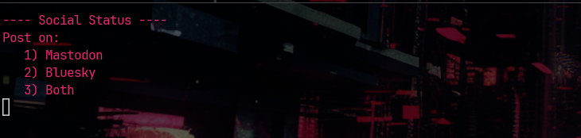

# Social Status

A little python script that lives in my terminal (Its a TUI) and allows me to post to multiple social media sites at once.

Currently supports posts with or without images on:

1) Mastodon
2) Bluesky

Social Status:

- Automatically resize images if they exceed the maximum size by bluesky.
- Dynamically counts and shows current characters in the status, with the limitations coded for both Mastodon and Bluesky
- Additionally, there is now an optional AI Image Tagging feature, which uses OpenAI to generate hashtags for images you are going to upload.

I may add more sites, if I used them. You are welcome to fork it and use it for yourself.

# Installation

* Download the code (clone it or download it and unzip it)
* Install python on the system (at least v3.10)
* Create a virtual environment using `python -m venv .` in the folder/dir of the code
* Activate the environment with `Scripts\activate.bat` on windows or `source bin/activate` on linux
* Run pip install to install all the required modules `pip install -r requirements.txt`

# Configuration

- Copy example.env to .env and add your credential information.
- For Mastodon you will need to run `py reg.py` once. This will register the app and get the keys necessary to make posts.
- Thats it
